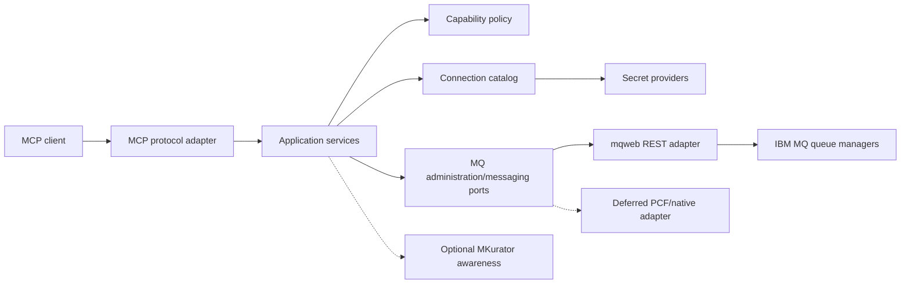

# Proposed system

Most of this document remains a design hypothesis. Go and the official MCP Go
SDK are accepted in [ADR-0001](../adr/0001-go-and-official-mcp-sdk.md).



## Boundaries

| Boundary | Responsibility |
| --- | --- |
| MCP adapter | Tool/resource registration, input/output schemas, protocol errors, transports |
| Application services | Use-case orchestration, pagination, result shaping, audit context |
| Capability policy | Resolve profile grants and deny unauthorized operations before I/O |
| Connection catalog | Resolve stable profile names to endpoint, queue manager, TLS, and credential references |
| IBM MQ ports | Typed domain operations independent of REST, MQSC, or PCF |
| mqweb adapter | HTTPS, authentication, CSRF headers, MQ REST/MQSC translation, error mapping |
| Secret providers | Environment/file/Kubernetes/external-secret integrations without leaking values |
| MKurator awareness | Optional discovery of declarative ownership; never required for generic MQ |

## Connection and policy model

A profile is the unit of selection, security, rate limiting, and auditing.

```yaml
profiles:
  production:
    queueManager: PROD1
    endpoint: https://mq.example.test:9443
    authentication:
      type: basic
      secretRef: env:MQ_PROD_CREDENTIALS
    tls:
      caRef: file:/etc/mq/production-ca.pem
    capabilities:
      - inspect
      - browse
  development:
    queueManager: DEV1
    endpoint: https://mq-dev.example.test:9443
    authentication:
      type: mtls
      certificateRef: file:/run/secrets/dev-client.pem
      privateKeyRef: file:/run/secrets/dev-client-key.pem
    capabilities:
      - inspect
      - browse
      - produce
```

The example is illustrative. The final schema and accepted secret-reference
schemes depend on design decisions.

Use operation-oriented capabilities rather than ambiguous global modes:

- `inspect`: queue managers, objects, status, depth, and diagnostics.
- `browse`: inspect message metadata and optionally payloads without consuming.
- `consume`: destructively retrieve messages.
- `produce`: put messages.
- `administer`: define, alter, or delete MQ objects through typed operations.
- `execute_mqsc`: exceptional escape hatch, disabled by default.

This model can express “read production, write development” while keeping
message access separate from administrative access.

## Proposed MCP surface

Initial tools should be few, typed, composable, and profile-explicit:

| Tool family | Examples | Required capability |
| --- | --- | --- |
| Discovery | list profiles, profile capabilities, connection health | local metadata / `inspect` |
| Inspection | list queues, get queue, queue status, channels, listeners | `inspect` |
| Messages | browse messages, get message, put message | `browse`, `consume`, `produce` |
| Administration | create/alter/delete supported objects | `administer` |
| Diagnostics | reason codes, authority diagnostics, connectivity checks | `inspect` |

Resources may expose stable documentation and object snapshots. Prompts may
guide diagnosis, but must not embed credentials or bypass policy.

## Safety rules

- The selected profile is required on every remote operation; no implicit
  production default.
- Policy is enforced before credential resolution or network access.
- Payload inclusion is opt-in, size-limited, and redacted where configured.
- Browse is not represented as non-destructive unless the adapter guarantees it.
- Mutations return before/after identifiers and audit metadata, not secrets.
- Bulk and destructive operations require bounded scopes and support dry-run
  when the backend can provide a truthful preview.
- Raw MQSC is absent from the default tool set.

## MKurator coexistence

The baseline server operates directly against IBM MQ and has no Kubernetes
dependency. Optional integration can:

- Detect objects represented by MKurator custom resources.
- Link an MQ object to its declarative owner.
- Warn that direct changes may be reconciled away.
- Prefer suggesting a CR change rather than mutating managed configuration.

The MCP server should not impersonate a Kubernetes operator or duplicate
MKurator's reconciliation loop.
