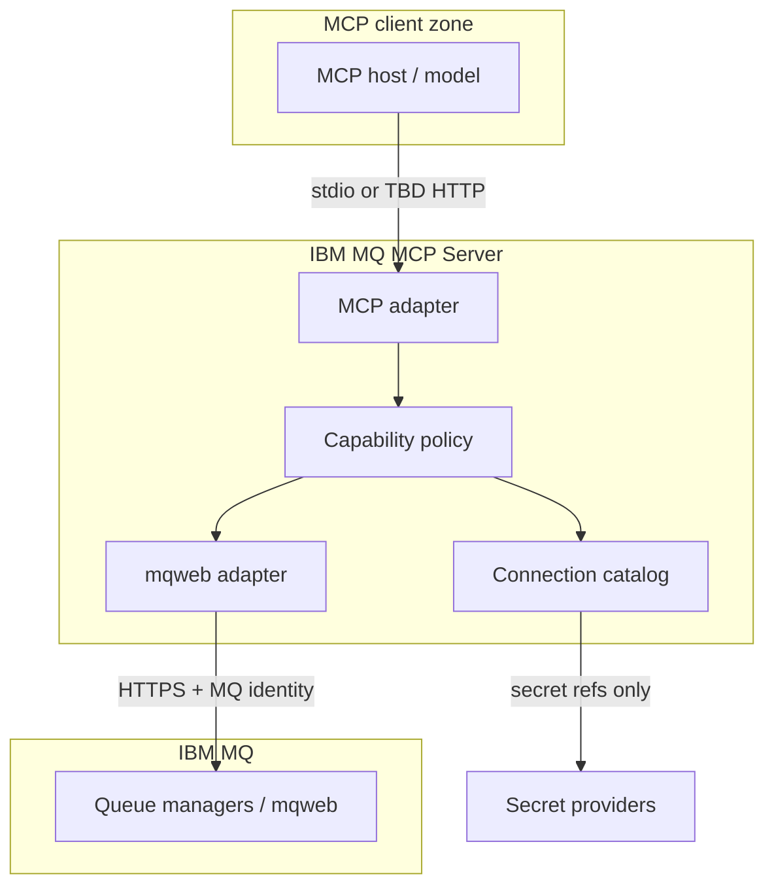

# Threat model

This document summarizes security boundaries for the IBM MQ MCP Server. It
extends themes from
[SECURITY.md](https://github.com/PlatformRelay/IBM-MQ-MCP-Server/blob/main/SECURITY.md)
and the [proposed system](../architecture/proposed-system.md). Detailed assurance
evidence grows with implementation stories; open ADRs mark unresolved areas.

## Scope

| In scope | Out of scope (today) |
| --- | --- |
| MCP client → server boundary | IBM MQ queue manager hardening |
| Connection profile trust boundary | Corporate IdP design |
| Policy deny-before-I/O | Penetration test reports |
| Credential handling in config/logs/tools | z/OS RACF administration |
| mqweb adapter HTTPS usage | MKurator controller security |

## Assets

- **MQ data** — messages, object definitions, depth, diagnostics reachable via
  granted capabilities.
- **Credentials** — basic/mTLS secrets for mqweb; future MCP client auth
  ([ADR-0006](../adr/README.md#decision-queue)).
- **Audit trail** — who invoked what against which profile ([SEC-002](https://github.com/PlatformRelay/IBM-MQ-MCP-Server/blob/main/agent-context/stories/SEC-002.md)).
- **Server integrity** — binary/container supply chain ([FND-003](https://github.com/PlatformRelay/IBM-MQ-MCP-Server/blob/main/agent-context/stories/FND-003.md)).

## Trust boundaries

### Profile trust boundary

Each **named profile** is an independent unit of:

- Endpoint and TLS trust
- Downstream MQ authentication
- Granted capabilities and (future) object filters
- Rate limits and audit context

Selecting a profile must not leak credentials or grants from another profile.
Policy evaluation happens **before** any mqweb I/O ([Policy](../policy.md)).

### Deny by default

Capabilities not explicitly granted for the active profile are rejected locally.
Denied operations must not reach IBM MQ. Metrics: `ibm_mq_mcp_policy_denials_total`
(profile label only).

### MCP vs MQ identity separation

- The **MCP client** identity (who asked the model to run a tool) is distinct
  from the **MQ credential** bound to the profile.
- Remote MCP authentication is **TBD** ([ADR-0006](../adr/README.md#decision-queue),
  [Authentication](../authentication.md)). Stdio deployments rely on OS/process
  boundaries of the MCP host.

## Threats and mitigations

| Threat | Impact | Mitigation (target / status) |
| --- | --- | --- |
| Prompt-triggered destructive MQ action | Data loss, outage | Deny-by-default capabilities; separate browse/consume/admin; audit ([SEC-002](https://github.com/PlatformRelay/IBM-MQ-MCP-Server/blob/main/agent-context/stories/SEC-002.md)) |
| Over-privileged profile | Unintended writes in production | Mixed grants via separate profiles; object filters TBD ([POL-002](https://github.com/PlatformRelay/IBM-MQ-MCP-Server/blob/main/agent-context/stories/POL-002.md)) |
| Credential leakage via logs/errors/tool output | Account compromise | Secret refs not inline; redacting logs ([Observability](../observability.md)); scrub CI |
| Credential leakage via config repo | Account compromise | Examples secret-free; gitleaks in CI |
| Unauthenticated remote MCP | Unauthorized MQ access | Remote transport unset until ADR-0006 — **do not expose HTTP MCP without auth design** |
| MQ credential theft from container | Lateral movement to MQ | Nonroot distroless image; mount secrets read-only (future deploy guidance) |
| Supply-chain tampering | Backdoored binary/image | cosign, SBOM, provenance, Trivy ([RELEASE.md](../RELEASE.md)) |
| Log injection via tool arguments | Log forging, SIEM noise | Argument sanitization in slog handler (OBS-001) |
| Probe amplification against MQ | QM load | `/readyz` does not call MQ (OBS-001) |
| Mutation of MKurator-managed objects | Reconciliation fight | Ownership hook TBD ([ADR-0007](../adr/README.md#decision-queue), [MKurator coexistence](../support/mkurator-coexistence.md)) |
| Raw MQSC escape hatch | Unbounded admin | Disabled by default; ADR-0008 |

## Residual risks (open)

- **mqweb browse semantics** may not meet non-destructive contract on all MQ
  versions — requires live validation ([MSG-001](https://github.com/PlatformRelay/IBM-MQ-MCP-Server/blob/main/agent-context/stories/MSG-001.md)
  spike).
- **Version/platform matrix** not certified — see [support matrix](../support/version-matrix.md).
- **Remote MCP auth** undecided — largest exposure if HTTP is enabled prematurely.

## Reporting

Report vulnerabilities privately — see
[SECURITY.md](https://github.com/PlatformRelay/IBM-MQ-MCP-Server/blob/main/SECURITY.md).

## Related pages

- [Authentication](../authentication.md)
- [Policy](../policy.md)
- [Design audit](../architecture/design-audit.md)
- [ADRs](../adr/README.md)
